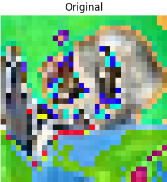
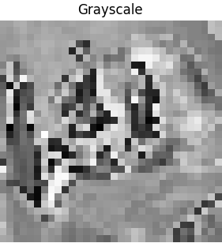
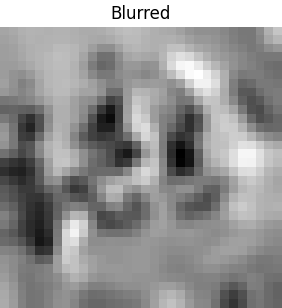
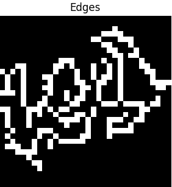

🧠 CIFAR-10 Image Classifier with PyTorch & Streamlit

A simple yet complete project that demonstrates image classification using a Convolutional Neural Network (CNN) trained on the CIFAR-10 dataset. The project includes model training, visualization, image preprocessing with OpenCV, and an interactive Streamlit web app for real-time predictions.

🚀 Features

CNN model using PyTorch

Trained on CIFAR-10 dataset

Training loss visualization

OpenCV preprocessing (grayscale, blur, edges)

Streamlit app to upload & predict image class

Model saving and loading (.pth)

Works with CPU or GPU

🖼️ Example: OpenCV Preprocessing

Original   
Grayscale   
Blurred    
Edges      

📁 Project Structure

├── .gitignore                 # Git ignore file
├── LICENSE                    # License file (MIT)
├── app.py                     # Streamlit app
├── notebook.ipynb             # Training notebook
├── README.md                  # Project documentation
├── requirements.txt           # Project dependencies
└── simple_cnn_cifar10.pth     # Trained model file

🛠️ Installation

git clone https://github.com/mibatura/cifar10-classifier.git
cd cifar10-classifier
pip install -r requirements.txt

📊 Run the notebook

Open Jupyter Notebook or VS Code
Run: model_train.ipynb

🌐 Run Streamlit App

streamlit run app.py
Then open your browser to: http://localhost:8501

💡 Model Info

- Dataset: CIFAR-10 (10 classes, 32x32 images)
- Accuracy: ~69% on test set
- Architecture: 2 Conv layers + 2 FC layers

🧪 TODO / Improvements

- Use larger image dataset (e.g., Cats vs Dogs)
- Try pre-trained models (ResNet, VGG)
- Deploy Streamlit app online (Streamlit Cloud / Hugging Face)
- Add confusion matrix + metrics

👨‍💻 **Author** 

Created by **Michael Batura** — feel free to use, share, or contribute!

